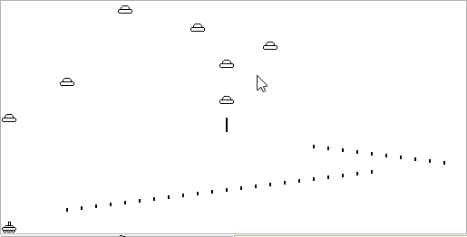

# NandSpaceInvaders

A simple space invaders game written in Jack for [Nand2Tetris Part II](https://www.coursera.org/learn/nand2tetris2)

## Table of Contents

- [Setup/Running](#setuprunning)
- [Controls](#controls)
- [Ending the Game](#ending-the-game)
- [Additional Notes](#additional-notes)
- [License](#license)

## Setup/Running

- Clone the repo to a folder named `NandSpaceInvaders`
- Compile the entire folder to VM code using the Nand2Tetris Jack Compiler
- Run the Nand2Tetris VM Emulator
- Open the compiled folder in the VM Emulator, running it with Animate set to "No animation"

## Controls

- <kbd>←</kbd> Move Tank Left
- <kbd>→</kbd> Move Tank Right
- <kbd>Space</kbd> Fire bullet

## Ending the Game

There is no real "winning" mechanism.  The game will keep track of how many invaders you destroy and will end when any 1 invader successfully lands.  It will then output a "GAME OVER" message as well as the count of destory invaders.

## Additional Notes

There are some additional classes and methods I used for testing/development such as `Logger` and anything named with the prefix `Test`.  These were really helpful for the dev process, but are not particularly necessary unless you wanted to continue development on this.

I've also made some design/logic decisions that are probably not best practice.  One such example is having my LinkedList `add` method always add at index 1 instead of at index 0 or the end of the list.  It was honestly just easier/faster to implement it that way.

Another example is that I've created both `BulletList` and `InvaderList` and there is a lot of repeat code between them.  There probably is a way to have made it a generic `LinkedList` instead, but I chose not to pursure that for 2 main reasons:

1. The purpose of this program was not really to become an expert in the Jack programming language.  The course states that this project's purpose is to help us familiarize ourselves with the Jack language since we'll be building a compiler for it later.
2. The game works as-is; I did not want to "waste" a lot of time trying to perfect something that I will likely never use again.

To build on point 2, there also may be a bug or 2 in how we process collisions between bullets and invaders.  For one, the rendering is not pixel-perfect so some collisions appear as if they're incorrect when from a coordinate perspective they are actually correct. Because the sprites are built in a 16x16 grid, they don't always 100% align horizontally.

Here's the formula we use to determine at which memory address to start drawing a sprite:

$$32 * y + x / 16$$

Because of this formula, combined with the sprites being 16x16, sprite drawing horizontally tends to jump every 16 pixels, rather than moving 1 pixel at a time.  From a gameplay perspective, it is mostly unnoticeable, but can be seen pretty evidently in that bullets are always equally spaced:

All-in-all, was a fun project.

## License

Licensed under MIT.
